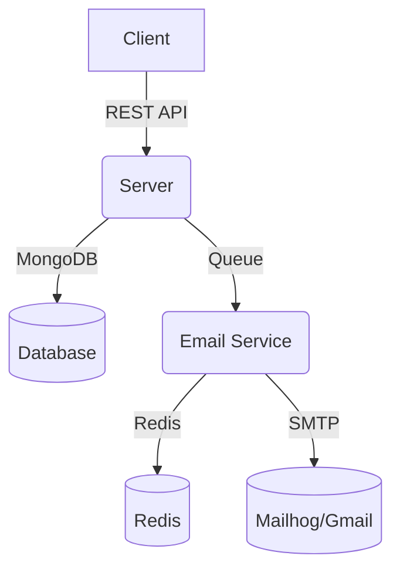

# Book Library API

A full-stack project for managing a digital book library, featuring user authentication, book management, reviews, favorites, and an email notification service. The project is split into two main components:

- **Server**: The main backend API (Node.js/Express, MongoDB)
- **Email Service**: Handles email notifications (Node.js, BullMQ, Nodemailer, Redis)

---

## Table of Contents

- [Features](#features)
- [Architecture](#architecture)
- [Getting Started](#getting-started)
  - [Prerequisites](#prerequisites)
  - [Environment Variables](#environment-variables)
  - [Running with Docker](#running-with-docker)
  - [Manual Setup](#manual-setup)
- [API Documentation](#api-documentation)
- [Project Structure](#project-structure)
- [License](#license)

---

## Features

- User authentication (local, Google, GitHub)
- Book CRUD operations
- Reviews and favorites
- File uploads (images, PDFs)
- Email notifications (verification, password reset, etc.)
- Rate limiting, logging, and error handling
- Swagger API documentation

---

## Architecture



---

## Getting Started

### Prerequisites

- [Node.js](https://nodejs.org/) v14+
- [Yarn](https://yarnpkg.com/) or [npm](https://www.npmjs.com/)
- [Docker](https://www.docker.com/) (recommended for local development)

### Environment Variables

#### Server (`/server/.env`)

```
PORT=3000
MONGODB_URI=mongodb://localhost:27017/book-library
JWT_SECRET=your_jwt_secret
GOOGLE_CLIENT_ID=...
GOOGLE_CLIENT_SECRET=...
GOOGLE_CALLBACK_URL=...
GITHUB_CLIENT_ID=...
GITHUB_CLIENT_SECRET=...
GITHUB_CALLBACK_URL=...
CLIENT_SSO_REDIRECT_URL=http://localhost:3000
BACKEND_URL=http://localhost:3000
REDIS_HOST=localhost
REDIS_PORT=6379
```

#### Email Service (`/email-service/.env`)

```
REDIS_HOST=localhost
REDIS_PORT=6379
NODE_ENV=development
MAILHOG_SMTP_HOST=localhost
MAILHOG_SMTP_PORT=1025
GMAIL_USER=your_gmail@gmail.com
GMAIL_PASS=your_gmail_password
```

### Running with Docker

This project provides a `docker-compose.yml` for MongoDB, Redis, and Mailhog (for email testing):

```sh
docker-compose up -d
```

- MongoDB: `localhost:27017`
- Redis: `localhost:6379`
- Mailhog UI: [http://localhost:8025](http://localhost:8025)

### Manual Setup

#### 1. Install dependencies

```sh
cd server
yarn install
cd ../email-service
yarn install
```

#### 2. Start the services

In separate terminals:

```sh
# Start the main server
cd server
yarn dev

# Start the email service
cd ../email-service
yarn dev
```

---

## API Documentation

Once the server is running, visit:

- [http://localhost:3000/](http://localhost:3000/) for the API
- [http://localhost:3000/api-docs](http://localhost:3000/api-docs) for Swagger UI

---

## Project Structure

```
book-library-api/
  ├── docker-compose.yml
  ├── email-service/
  │   ├── index.js
  │   ├── sendEmail.js
  │   ├── constants.js
  │   └── ...
  └── server/
      ├── src/
      │   ├── app.js
      │   ├── index.js
      │   ├── controllers/
      │   ├── models/
      │   ├── routes/
      │   └── ...
      └── public/
```

---

## License

MIT
